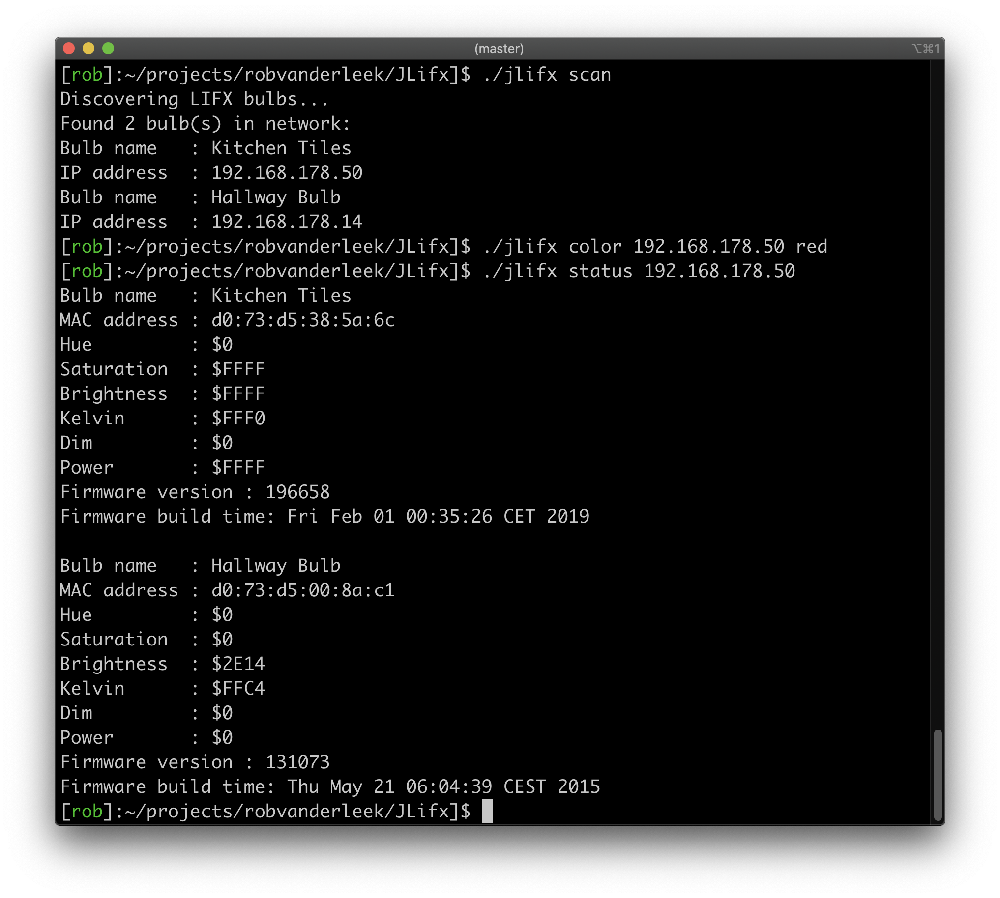

# JLifx



[](https://bettercodehub.com)
[](https://github.com/robvanderleek/JLifx/actions)
[](https://github.com/robvanderleek/JLifx/actions)
[](https://coveralls.io/r/robvanderleek/JLifx?branch=master)
[](https://maven-badges.herokuapp.com/maven-central/io.github.robvanderleek/jlifx)

Small LIFX Wifi LED bulb control library and utility written in Java.

This project is not, in any way, affiliated or related to LIFX Labs.

Implementation is based on the specification by LIFX Labs (https://lan.developer.lifx.com/docs/introduction)

## Installation

### Command line tool

Run the `build-cli.sh` script to build the executable JAR `jlifx`.

### Library

For Maven, add the following entry to your `pom.xml` (check https://search.maven.org/artifact/io.github.robvanderleek/jlifx for latest `$VERSION`):

```xml
    ...
    <dependencies>
        ...
        <dependency>
            <groupId>io.github.robvanderleek</groupId>
            <artifactId>jlifx</artifactId>
            <version>$VERSION</version>
        </dependency>
    </dependencies>
    ...
```

## Usage

### As command line tool
Build the executable JAR and run it from the command line, this will display 
the supported commands:

	$ ./jlifx

Examples:

    ./jlifx switch all off
    ./jlifx color all red
    ./jlifx color livingroom red
    ./jlifx blink gateway
    ./jlifx blink 192.168.178.50 3
    ./jlifx rainbow all
    ./jlifx rainbow all 30
    
### As library
Examples that show how to use the API:
- Discover a bulb by name and set color: [ColorBulbByName.java](https://github.com/robvanderleek/JLifx/blob/master/src/test/java/io/github/robvanderleek/jlifx/examples/ColorBulbByName.java)
- Discover a bulb by IP address and set color: [ColorBulbByIpAddress.java](https://github.com/robvanderleek/JLifx/blob/master/src/test/java/io/github/robvanderleek/jlifx/examples/ColorBulbByIpAddress.java)
- Discover a bulb by name and make it blink: [BlinkBulbByName.java](https://github.com/robvanderleek/JLifx/blob/master/src/test/java/io/github/robvanderleek/jlifx/examples/BlinkBulbByName.java)
- Connect to bulb using IP and MAC address: [ConnectWithIpAddressAndMacAddress.java](https://github.com/robvanderleek/JLifx/blob/master/src/test/java/io/github/robvanderleek/jlifx/examples/ConnectWithIpAddressAndMacAddress.java)
